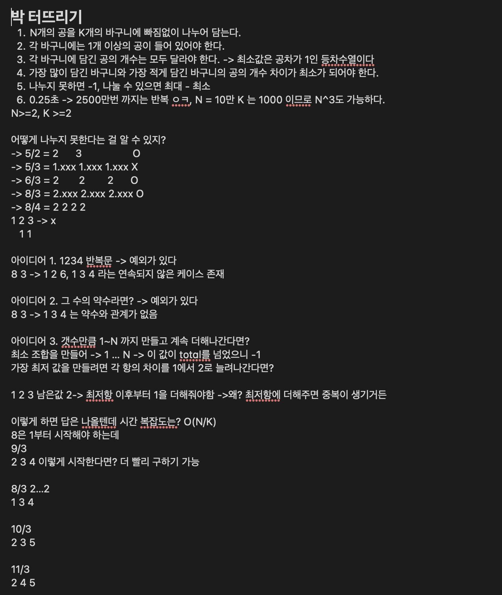

# week1

## BOJ

### [S]4673: 셀프 넘버
- 접근 방법
    - [선택]모든 경우를 직접 구하기로 결정(10000까지의 수라서 bruteforce 가능할 것이라고 판단
- 풀이
    - 1부터 10000까지 글자를 만들고 자릿수별로 자르고 더해서 Set에 저장
    - 1부터 10000까지의 집합에서 위에서 구한 집합을 정렬해서 출력

### [F]7568: 덩치
- 접근 방법
    - 방법 자체가 떠오르지 않았음
    - 키와 몸무게 순으로 정렬해서 같은 위치를 가지고 있는 사람을 고정하고 그 중간에 낀 사람들을 등수 처리 하면 되겠다고 생각했지만 구현이 막막함

### [S]11723: 집합
- 접근 방법
    - [선택]Set 에서 지원하는 기능이라고 생각하여 접근. 3,000,000 정도의 수는 해싱하는데에 오래 걸리지 않을 거라고 생각함
- 풀이
    - Set을 정의하고 자료구조에서 지원하는 기능들을 사용하여 구현 

### [S]1138: 한 줄로 서기
- 접근 방법
    = 하루 넘게 고민함
    - [선택]키가 작은 사람들 부터 배치하면 N번 안으로 끝날 것이라고 생각하여 키가 작은 순으로 옆에 키 큰사람이 올 수 있는 공간의 숫자를 세서 우선 배치
- 풀이
    - 방문 배열을 사용해서 이미 선점한 자리를 빼앗지 못하도록 함

### [S]18405: 경쟁적 전염
- 접근 방법
    - 맵의 크기가 200^2로 1초안에 들기엔 부담이 없을 것이라고 생각
    - 바이러스가 존재하는 칸을 찾아서 비어 있거나 나보다 큰 수가 차있으면 숫자를 변경하는 식으로 하면 될 것 같다고 생각함
    - [선택]가장 숫자가 작은 칸부터 선택해서 미리 전염을 시키는 방법을 사용
- 풀이
    - 숫자가 적은 순서대로 전염을 시키기 위해 숫자가 적은 순으로 정렬해야함 -> heapq 사용
    - 전염이 되면 새로운 heap 에 좌표를 넣고 넣은 좌표를 활용하여 다음 시간에 전염 진행

### [F]2422: 한윤정이 이탈리아에 가서 아이스크림을 사먹는데
- 접근 방법
    - 불가능한 조합을 선택하지 않도록 방문 배열을 만들고, 그 배열이 방문 처리 되어 있는 경우 선택할 수 없도록 함
    - 시간이 초과되어 조합을 만드는데에 접근 시간이 오래 걸려서 그런 것이라 생각하여 Map으로 변경하였지만 변화는 없었음
    - C_{200}^{3} 이라서 시간 초과는 걸리지 않을 것 같은데 구현에서 막힘

### [F]16236: 아기 상어 
- 접근 방법
    - 문제를 잘 이해하지 못함. -> 특히 이동방법과 물고기가 많은 방향으로 간다는 점이 이해가 안됨
    - 상하좌우로 이동하는 건데 가까운 거리의 고기를 먹는다는게 무슨말인지???

### [S]19939: 박 터뜨리기
- 접근 방법
    - 상수시간에 끝나야 해서 정말 많이 고민함(0.25초)
    - 가능한 경우를 메모하면서 적고 패턴을 파악하려고 함
- 이미지
    
- 풀이
    - 가장 차이가 적은 조합을 만들고 그 조합보다 수가 작은경우 -1
    - 짝수인 경우 첫 시작 조합에서 나누려는 숫자의 배수만큼 더해질 때 마다 K-1 이라는 최소의 값을 같고 그 외에는 K
    - 홀수인 경우 나누어 떨어지면 K-1 그 외에는 K 

### [S]1475: 방 번호
- 접근 방법
    - [선택]6인 경우를 모두 9로 바꾸어서 계산
- 풀이
    - 들어온 숫자 마다 갯수를 세고 9의 갯수를 절반으로 나누고 올림 한 수와 그 외의 숫자가 카운팅 된 수 중 가장 큰 수를 리턴

## Reference

- Boj : https://www.acmicpc.net/problem/4673, https://www.acmicpc.net/problem/7568, https://www.acmicpc.net/problem/11723, https://www.acmicpc.net/problem/1138, https://www.acmicpc.net/problem/18405, https://www.acmicpc.net/problem/2422, https://www.acmicpc.net/problem/16236, https://www.acmicpc.net/problem/19939, https://www.acmicpc.net/problem/1475