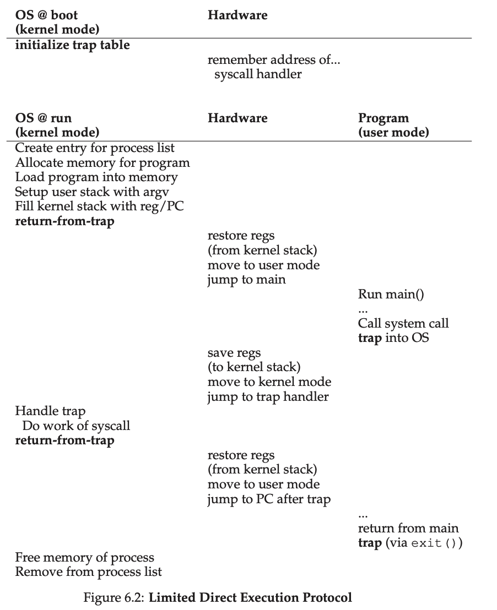

# week8
- kakao review
- database query
- 운영체제 강의

## 추후 일정
```
4일 - A형 대비 라이브 코딩(SWEA), 코드 리뷰
6일 - OS: CPU scheduling, Multi-level Feedback
```

## Database
- 정답(Row count)
    ```sql
    d.
    select c.customerName as '회사이름', count() as '주문회수', MAX(tmp.sum) as '최대금액',SUM(tmp.sum) / count() as'평균금액'
    from 
        (select o.orderNumber as orderNumber ,o.customerNumber as customerNumber, SUM(od.priceEach * od.quantityOrdered) as 'sum' 
        from orderdetails od join orders o on od.orderNumber = o.orderNumber
        group by o.orderNumber) tmp 
    join customers c on tmp.customerNumber = c.customerNumber
    group by c.customerNumber;
    
    e.
    select c.customerName, tmp.date, tmp.max
    from customers c,
        (select o.orderNumber,o.orderDate as date, o.customerNumber as customerNumber,SUM(od.priceEach * od.quantityOrdered) as max
        from orderdetails od join orders o on od.orderNumber = o.orderNumber 
        group by o.orderNumber
        order by max desc limit 1) tmp
    where c.customerNumber = tmp.customerNumber;
    ```
- tip
    - join 할 때, using option 을 사용하면 같은 column name 끼리 join 된다.

## Operating System
Restrict operations
- Operations that should run indirectly ( in a privileged mode)
    - gain more system resources such as CPU and memory
- Through a well defined APIs (system call)
    - e.g) fork(), nice(), malloc(), open(), read(), write()…

User mode vs Kernel mode
- User mode : do privileged option
- Kernel mode : 

trap -> software interrupt

interrupt routine
1. occurs hardware interrupt 
2. os booting 시에 생성된 interrupt handler table 을 참고하여 어떤 동작을 수행 할 것인지 판단 후 수행

How to handle trap in OS?
- Using trap table ( a.k.a interrupt vector table)
- Trap table consists of a set of trap handler
- e.g ) system call processing
    - syscall(e.g fork() -> make process) -> trap -> save context and switch stack -> jump to the trap handler -> eventually in kernel mode

Context switch with Time interrupt
- Two approach
    - A cooperative approach : exploiting system calls
        - Processes use system call -> control transfer to OS -> do scheduling(ans switching)
        - A process causes exception ( e.g page fault or divide by zero) -> transfer control to OS
        - A process that seldom uses a system call -> invoke an yield() system call explicity
        - No Method for a process that does an infinite loop
    - A non-cooperative approach : using timer interrupt
        - Interrupt : a mechanisim that a device notify an event to OS
        - Timer interrupt
            - Timer device raises an interrupt every ms
        - Context save and restore
            - Context : information of a process needed when it is re-scheduled later

Context switch : global view


Context switch
- memorize the last state of a process when it is preempted
    - Context save : storing CPU registers into PCB
    - Context restore : loading PCB into CPU registers
- context-switch time is overhead(system does not useful work while switching)
    - Utilizing hardware support(hyper-threading)

Worried about concurrency
- issues
    - What happens when you are handling one interrupt and another one occurs?
    - What happen when, during a system call, a timer interrupt occurs?
- Some solutions
    - Disable interrupt (note : disable interrupt too long is dangerous)
    - Priority
    - Locking mechanism
    - => actually Concurrency issue

## Reference

- boj : [다음주문제집](https://www.acmicpc.net/group/workbook/view/15281/49695)

- database : [E-R diagram](https://www.mysqltutorial.org/mysql-sample-database.aspx)

- lecture : [운영체제](http://www.kocw.net/home/search/kemView.do?kemId=1046323), [OSTEP](https://pages.cs.wisc.edu/~remzi/OSTEP/)
[OSTEP 번역](https://github.com/remzi-arpacidusseau/ostep-translations/blob/master/korean/README.md)
